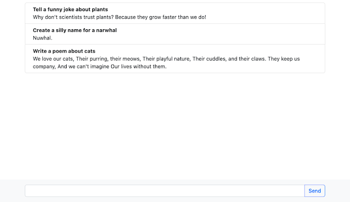

#OpenAI-Challenge

## About

A simple chatbot that uses OpenAI to generate responses to fun queries like:

- Write a poem about cats
- Create a silly name for a narwhal
- Tell a funny joke about plants

It will also store and retrieve your chat history using local storage.

## Usage

Deployed URL: https://openai-challenge.herokuapp.com/

1. Enter your prompt into the text field at the bottom.
2. Click "Send", or press return/enter on your keyboard.
3. Wait a moment for your results to appear on screen. Voila!

## Install

1. [Sign up](https://auth0.openai.com/u/signup/identifier?state=hKFo2SAyZVBzb09KZGZFd0Rad2ZtRXBnNUdpeVJUclM3TVRHT6Fur3VuaXZlcnNhbC1sb2dpbqN0aWTZIHRFc2U0ZVB2Z2pTQ05EdjU4NmpOSDdMNjhOUkNzd0pWo2NpZNkgRFJpdnNubTJNdTQyVDNLT3BxZHR3QjNOWXZpSFl6d0Q) for OpenAI and get your API key.
2. Run `npm i` from the project directory.
3. Create a file named `.env`, enter `API_KEY=` and paste in your API key.
4. Run `npm start`
5. In your browser, navigate to `localhost:3000`
